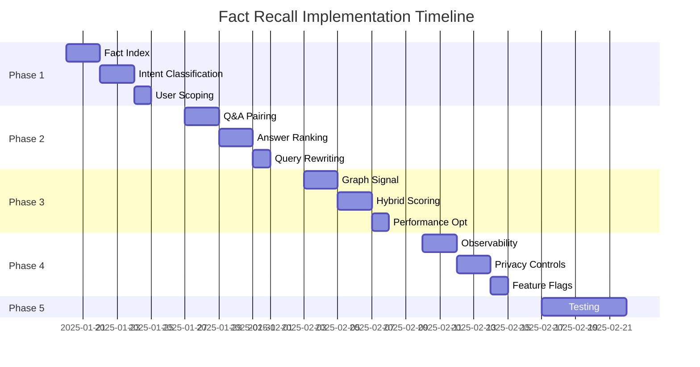

# Fact Recall Implementation Plan for Veris Memory

## Executive Summary

This document outlines a phased implementation plan to fix semantic recall failures for personal facts in Veris Memory. The system currently stores facts but fails to retrieve them for short, fact-lookup questions due to embedding mismatches and lack of fact-specific retrieval paths.

**Goal**: Achieve P@1 ≥ 0.98 for fact queries like "What's my name?" after storing "My name is Matt."

## Phase 1: Foundation (Week 1)
**Objective**: Establish deterministic fact storage and basic retrieval

### 1.1 Deterministic Fact Index (2 days)
```python
# Location: src/storage/fact_store.py
class FactStore:
    """
    Redis-backed deterministic fact storage with lineage tracking
    Key pattern: facts:{namespace}:{user_id}:{attribute}
    """
    def store_fact(self, namespace: str, user_id: str, attribute: str, value: Any) -> None
    def get_fact(self, namespace: str, user_id: str, attribute: str) -> Optional[Any]
    def get_user_facts(self, namespace: str, user_id: str) -> Dict[str, Any]
```

**Implementation Tasks**:
- [ ] Create `src/storage/fact_store.py` with Redis integration
- [ ] Add fact extraction patterns in `src/core/fact_extractor.py`
- [ ] Implement lineage tracking for fact updates
- [ ] Add unit tests for fact CRUD operations

### 1.2 Intent Classification (2 days)
```python
# Location: src/core/intent_classifier.py
class IntentClassifier:
    """
    Lightweight intent detection for fact vs. general queries
    """
    def classify(self, query: str) -> IntentType
    def extract_fact_attribute(self, query: str) -> Optional[str]
```

**Implementation Tasks**:
- [ ] Create intent classifier with pattern matching
- [ ] Define fact query patterns (name, email, preferences, etc.)
- [ ] Add confidence scoring for intent detection
- [ ] Create test suite with diverse query patterns

### 1.3 Strict User Scoping (1 day)
```python
# Location: src/middleware/scope_validator.py
class ScopeValidator:
    """
    Enforces namespace/tenant/user scoping on all operations
    """
    def validate_scope(self, request: Request) -> ScopeContext
    def apply_scope_filter(self, query: Query, scope: ScopeContext) -> Query
```

**Implementation Tasks**:
- [ ] Enhance existing agent namespace system
- [ ] Add scope validation middleware
- [ ] Update all retrieval paths with scope filters
- [ ] Add integration tests for multi-tenant isolation

**Deliverables**:
- Working fact storage with Redis backend
- Basic intent classification for fact queries
- Strict user/tenant isolation on all paths
- 50+ unit tests covering core functionality

## Phase 2: Enhanced Retrieval (Week 2)
**Objective**: Implement Q&A pairing and improved ranking

### 2.1 Q&A Pair Generation (2 days)
```python
# Location: src/core/qa_generator.py
class QAPairGenerator:
    """
    Generates question-answer pairs from declarative statements
    """
    def generate_qa_pairs(self, statement: str) -> List[QAPair]
    def create_stitched_unit(self, question: str, answer: str) -> StitchedUnit
```

**Implementation Tasks**:
- [ ] Create Q&A pair generator with templates
- [ ] Implement stitched unit creation for joint indexing
- [ ] Add Neo4j edges for Q&A relationships
- [ ] Update storage pipeline to generate pairs

### 2.2 Answer-Priority Ranking (2 days)
```python
# Location: src/storage/fact_ranker.py
class FactAwareRanker:
    """
    Enhanced ranker with fact-specific scoring
    """
    def apply_answer_prior(self, results: List[Result]) -> List[Result]
    def boost_declarative_patterns(self, text: str) -> float
    def demote_interrogative_patterns(self, text: str) -> float
```

**Implementation Tasks**:
- [ ] Extend existing reranker with fact patterns
- [ ] Define boost/demote pattern rules
- [ ] Integrate with cross-encoder reranking
- [ ] Add A/B testing framework for ranking

### 2.3 Query Rewriting (1 day)
```python
# Location: src/core/query_rewriter.py
class FactQueryRewriter:
    """
    Rewrites fact queries to improve recall
    """
    def rewrite_fact_query(self, query: str, intent: IntentType) -> List[str]
    def generate_fact_templates(self, attribute: str) -> List[str]
```

**Implementation Tasks**:
- [ ] Create template-based query rewriter
- [ ] Define fact-specific rewrite patterns
- [ ] Implement bounded fanout (max 3 variants)
- [ ] Add performance monitoring

**Deliverables**:
- Q&A pair generation and indexing
- Fact-aware ranking with pattern boosts
- Query rewriting for improved recall
- Integration tests for retrieval pipeline

## Phase 3: Graph Integration (Week 3)
**Objective**: Leverage graph signals for entity-rich queries

### 3.1 Graph Signal Activation (2 days)
```python
# Location: src/storage/graph_enhancer.py
class GraphSignalEnhancer:
    """
    Conditional graph signal contribution for fact queries
    """
    def compute_graph_score(self, query: str, context: Context) -> float
    def get_entity_edges(self, entity: str) -> List[Edge]
    def apply_gamma_graph(self, scores: Dict, gamma: float) -> Dict
```

**Implementation Tasks**:
- [ ] Implement conditional gamma_graph activation
- [ ] Add entity extraction and linking
- [ ] Create feature gate for graph signals
- [ ] Add fallback for no-edge scenarios

### 3.2 Hybrid Scoring Integration (2 days)
```python
# Location: src/storage/hybrid_scorer.py
class HybridScorer:
    """
    Combines vector, lexical, and graph signals
    """
    def compute_hybrid_score(
        self,
        alpha_dense: float,
        beta_lexical: float, 
        gamma_graph: float
    ) -> float
```

**Implementation Tasks**:
- [ ] Update hybrid scoring with graph component
- [ ] Implement configurable weight system
- [ ] Add score explanation generation
- [ ] Create weight tuning framework

### 3.3 Performance Optimization (1 day)
**Implementation Tasks**:
- [ ] Add Redis caching for graph ego-nets
- [ ] Implement timeouts (KV: 3ms, Graph: 10ms)
- [ ] Add query result caching
- [ ] Optimize hot paths with profiling

**Deliverables**:
- Graph signal integration with feature gates
- Hybrid scoring with three components
- Performance optimizations and caching
- Load testing results

## Phase 4: Observability & Safety (Week 4)
**Objective**: Add monitoring, privacy controls, and rollout infrastructure

### 4.1 Comprehensive Observability (2 days)
```python
# Location: src/monitoring/fact_telemetry.py
class FactTelemetry:
    """
    Detailed tracing for fact retrieval pipeline
    """
    def trace_request(self, request: Request) -> TraceContext
    def log_routing_decision(self, intent: IntentType, route: str) -> None
    def record_ranking_explanation(self, explanation: Dict) -> None
```

**Implementation Tasks**:
- [ ] Add OpenTelemetry instrumentation
- [ ] Implement ring buffer for failures
- [ ] Create dashboards for key metrics
- [ ] Add alerting rules

### 4.2 Privacy & Security (2 days)
```python
# Location: src/security/privacy_manager.py
class PrivacyManager:
    """
    PII handling and user data management
    """
    def mask_pii_in_logs(self, text: str) -> str
    def handle_forget_request(self, user_id: str) -> None
    def encrypt_fact_at_rest(self, fact: Fact) -> EncryptedFact
```

**Implementation Tasks**:
- [ ] Implement PII detection and masking
- [ ] Create forget-me endpoint
- [ ] Add encryption for sensitive facts
- [ ] Implement audit logging

### 4.3 Feature Flags & Rollout (1 day)
```python
# Location: src/config/feature_flags.py
FACT_FEATURES = {
    "facts_layer_enabled": True,
    "qa_pairing_enabled": True,
    "graph_signal_enabled": "guarded",
    "query_rewrite_enabled": True,
    "answer_prior_boost_enabled": True
}
```

**Implementation Tasks**:
- [ ] Implement feature flag system
- [ ] Create rollout configuration
- [ ] Add A/B testing support
- [ ] Setup canary deployment

**Deliverables**:
- Complete observability pipeline
- Privacy controls and PII handling
- Feature flag system for gradual rollout
- Production-ready monitoring

## Phase 5: Testing & Validation (Week 5)
**Objective**: Comprehensive testing and performance validation

### 5.1 Test Suite Development
**Test Categories**:
- Unit tests: 100+ tests for all components
- Integration tests: End-to-end fact flow
- Performance tests: Latency and throughput
- Security tests: Multi-tenant isolation
- Regression tests: Existing functionality

### 5.2 Gold Dataset Creation
```json
{
  "test_cases": [
    {
      "setup": "My name is Matt",
      "query": "What's my name?",
      "expected": "Matt",
      "metric": "exact_match"
    },
    {
      "setup": "I prefer spicy food",
      "query": "What food do I like?",
      "expected": "spicy",
      "metric": "contains"
    }
  ]
}
```

### 5.3 Performance Benchmarking
**Target Metrics**:
- P@1 ≥ 0.98 for fact queries
- MRR@10 ≥ 0.98
- p95 latency ≤ 300ms
- No cross-user leakage

**Deliverables**:
- Comprehensive test suite
- Gold dataset with 100+ examples
- Performance benchmark results
- Security audit report

## Implementation Timeline



## Rollout Strategy

### Stage 1: Development (Week 1-4)
- All features enabled in dev environment
- Continuous integration testing
- Daily progress reviews

### Stage 2: Canary 5% (Week 5)
- Facts layer + priors + rewrites enabled
- gamma_graph = 0.05 for fact intents
- Monitor P@1 and latency metrics

### Stage 3: Canary 20% (Week 6)
- gamma_graph = 0.10 for fact intents
- A/B testing for ranking variations
- Collect user feedback

### Stage 4: Full Rollout (Week 7)
- 100% deployment with tuned weights
- Continuous monitoring
- Performance optimization based on production data

## Risk Mitigation

| Risk | Mitigation |
|------|------------|
| Regex pattern false positives | Validate with large test corpus, use confidence thresholds |
| Stale facts after updates | Implement lineage tracking, cache invalidation |
| Latency increase | Aggressive timeouts, caching, async processing |
| Cross-user data leakage | Strict scoping, security testing, audit logs |
| Embedding model changes | Abstract embedding service, version management |

## Success Criteria

✅ **Quality Metrics**:
- Fact query P@1 ≥ 0.98
- MRR@10 ≥ 0.98
- Coverage@1 = 1.0 on gold set

✅ **Performance Metrics**:
- p95 latency ≤ 300ms
- No p95 regression > 5%
- p99 tracked and optimized

✅ **Safety Metrics**:
- Zero cross-user leakage
- Zero PII in logs
- 100% audit coverage

## File Structure Overview

```
veris-memory/
├── src/
│   ├── core/
│   │   ├── fact_extractor.py      # NEW: Extract facts from text
│   │   ├── intent_classifier.py   # NEW: Classify query intent
│   │   ├── qa_generator.py        # NEW: Generate Q&A pairs
│   │   └── query_rewriter.py      # NEW: Rewrite fact queries
│   ├── storage/
│   │   ├── fact_store.py          # NEW: Redis fact storage
│   │   ├── fact_ranker.py         # NEW: Fact-aware ranking
│   │   ├── graph_enhancer.py      # NEW: Graph signal integration
│   │   └── hybrid_scorer.py       # MODIFY: Add graph component
│   ├── middleware/
│   │   └── scope_validator.py     # NEW: Enforce scoping
│   ├── monitoring/
│   │   └── fact_telemetry.py      # NEW: Fact-specific telemetry
│   ├── security/
│   │   └── privacy_manager.py     # NEW: PII and privacy
│   └── mcp_server/
│       └── server.py               # MODIFY: Integrate fact layer
├── tests/
│   ├── facts/                     # NEW: Fact-specific tests
│   │   ├── test_extractor.py
│   │   ├── test_intent.py
│   │   ├── test_qa_generation.py
│   │   ├── test_ranking.py
│   │   └── test_e2e.py
│   └── gold_dataset.json          # NEW: Test dataset
└── config/
    └── feature_flags.py            # NEW: Feature configuration
```

## Next Steps

1. **Immediate Actions**:
   - Set up development branch: `feature/fact-recall-fix`
   - Create initial file structure
   - Begin Phase 1 implementation

2. **Team Coordination**:
   - Assign workstream owners
   - Schedule daily standups
   - Set up tracking dashboard

3. **Dependencies**:
   - Ensure Redis is available for fact storage
   - Verify Neo4j schema supports new edges
   - Confirm embedding service capacity

This phased approach ensures systematic implementation with clear deliverables, comprehensive testing, and safe rollout to production.