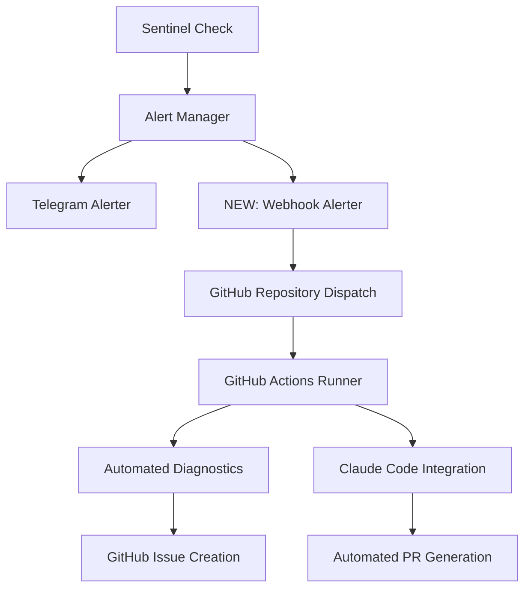

# 🚨 Webhook + GitHub Actions + Claude Code Integration Plan

## 🧠 ULTRATHINK ANALYSIS

### Current Problem Statement
**Core Issue**: Sentinel monitoring alerts are invisible to Claude Code, requiring manual intervention and preventing automated debugging.

**Current Flow**:
```
Sentinel Alert → Telegram → Human → Manual Claude Session → Manual Fix
```

**Desired Flow**:
```
Sentinel Alert → Webhook → GitHub Actions → Claude Code → Automated Fix → PR
```

## 🔍 DEEP INVESTIGATION

### 1. Current Sentinel Alert Architecture
- **Alert Generation**: Sentinel checks (S1-S11) run every 60 seconds
- **Alert Delivery**: TelegramAlerter sends formatted messages
- **Alert Content**: Structured JSON with severity, check_id, message, details
- **Current Recipients**: Telegram chat only

### 2. Integration Points Analysis


### 3. Technical Challenges Identified

#### 3.1 Authentication & Security
- **GitHub Token**: Runner needs repo write access
- **Claude Code Auth**: How runner authenticates to Claude CLI
- **Webhook Security**: HMAC signing to prevent abuse
- **Service Access**: Runner accessing production services

#### 3.2 Environment & Network
- **GitHub Runner Environment**: Ubuntu with limited tools
- **Network Connectivity**: Runner reaching Veris Memory services
- **Docker Network**: Accessing internal services
- **Rate Limiting**: Preventing webhook spam

#### 3.3 Claude Code Integration
- **API Authentication**: Claude Code API integration
- **Session Management**: Creating and managing Claude sessions
- **Context Passing**: Passing alert context to Claude
- **Result Retrieval**: Getting fixes back from Claude

## 📋 PHASED IMPLEMENTATION PLAN

## Phase 1: Basic Webhook Infrastructure (Week 1)

### 1.1 Webhook Endpoint Implementation
**Goal**: Create secure webhook endpoint that receives Sentinel alerts

**Components**:
```python
# src/monitoring/sentinel/webhook_alerter.py
class WebhookAlerter:
    async def send_github_webhook(self, alert_data):
        # Send repository_dispatch event to GitHub
        # Include alert metadata and severity
        pass
```

**GitHub Actions Workflow**:
```yaml
# .github/workflows/sentinel-alert-response.yml
name: 🚨 Sentinel Alert Response
on:
  repository_dispatch:
    types: [sentinel-alert]

jobs:
  alert-response:
    runs-on: ubuntu-latest
    steps:
      - name: Process Alert
        run: echo "Alert: ${{ github.event.client_payload.alert }}"
      - name: Create Issue for Critical
        if: github.event.client_payload.severity == 'critical'
        run: |
          gh issue create \
            --title "🚨 Critical: ${{ github.event.client_payload.check_id }}" \
            --body "${{ github.event.client_payload.message }}"
```

### 1.2 Integration with Sentinel
**Modify Alert Manager**:
```python
# src/monitoring/sentinel/alert_manager.py
class AlertManager:
    def __init__(self):
        self.alerters = [
            TelegramAlerter(),
            WebhookAlerter()  # NEW
        ]
    
    async def send_alert(self, alert):
        for alerter in self.alerters:
            await alerter.send(alert)
```

### 1.3 Security Implementation
- HMAC signature verification
- Rate limiting (max 10 alerts/minute)
- GitHub token with minimal permissions

**Success Criteria Phase 1**:
- ✅ Sentinel alerts trigger GitHub Actions
- ✅ Critical alerts create GitHub issues automatically
- ✅ Webhook is secure and rate-limited
- ✅ End-to-end flow working

## Phase 2: Enhanced Diagnostics (Week 2)

### 2.1 Automated Health Checks
**GitHub Runner Diagnostics**:
```yaml
- name: Diagnose Services
  run: |
    # Check all Veris Memory services
    curl -f http://167.235.112.106:8000/ || echo "❌ MCP Server Down"
    curl -f http://167.235.112.106:8001/api/v1/health || echo "❌ API Down"
    curl -f http://167.235.112.106:9090/status || echo "❌ Sentinel Down"
    
    # Check infrastructure
    ping -c 1 167.235.112.106 || echo "❌ Server Unreachable"
    
    # Check database connectivity
    # (Add database-specific health checks)
```

### 2.2 Log Collection
```yaml
- name: Collect Logs
  run: |
    # SSH into server and collect recent logs
    ssh -o StrictHostKeyChecking=no user@167.235.112.106 \
      "docker logs veris-memory-api --tail=100" > api.log
    
    # Upload logs as artifacts
    gh workflow run upload-logs.yml --field logs="$(cat api.log)"
```

### 2.3 Intelligent Issue Creation
```yaml
- name: Create Detailed Issue
  run: |
    ISSUE_BODY=$(cat << EOF
    ## 🚨 Alert Details
    - **Check**: ${{ github.event.client_payload.check_id }}
    - **Severity**: ${{ github.event.client_payload.severity }}
    - **Time**: $(date)
    
    ## 📊 Diagnostic Results
    $(cat diagnostic-results.txt)
    
    ## 📋 Recent Logs
    $(cat recent-logs.txt)
    
    ## 🔧 Suggested Actions
    - [ ] Check service status
    - [ ] Review error logs
    - [ ] Verify network connectivity
    EOF
    )
    
    gh issue create --title "🚨 ${{ github.event.client_payload.check_id }}" --body "$ISSUE_BODY"
```

**Success Criteria Phase 2**:
- ✅ Detailed diagnostic information collected
- ✅ Rich GitHub issues with context
- ✅ Log collection and analysis
- ✅ Actionable debugging information

## Phase 3: Claude Code Integration (Week 3)

### 3.1 Claude Code API Integration
**Research needed**:
- Claude Code API endpoints
- Authentication mechanism
- Session creation and management
- Context passing and result retrieval

### 3.2 Automated Debugging Session
```yaml
- name: Launch Claude Code Debug Session
  if: github.event.client_payload.severity == 'critical'
  run: |
    # Create Claude Code session with alert context
    CLAUDE_SESSION=$(claude-code create-session \
      --context "Sentinel alert: ${{ github.event.client_payload.check_id }}" \
      --workspace "/claude-workspace" \
      --auto-debug)
    
    echo "Claude session: $CLAUDE_SESSION"
```

### 3.3 Automated Fix Generation
```yaml
- name: Generate Automated Fix
  run: |
    # Pass alert details to Claude
    claude-code send-message \
      --session $CLAUDE_SESSION \
      --message "Debug and fix: ${{ github.event.client_payload.message }}"
    
    # Wait for Claude to generate solution
    SOLUTION=$(claude-code get-result --session $CLAUDE_SESSION)
    
    # Apply fix if safe
    if [[ "$SOLUTION" == *"SAFE_TO_APPLY"* ]]; then
      echo "Applying automated fix..."
      # Apply the fix
    else
      echo "Manual review required"
    fi
```

### 3.4 PR Creation
```yaml
- name: Create Fix PR
  run: |
    git checkout -b fix/automated-${{ github.run_id }}
    # Apply Claude's fixes
    git add .
    git commit -m "fix: Automated fix for ${{ github.event.client_payload.check_id }}"
    git push
    gh pr create --title "🤖 Automated Fix" --body "Generated by Claude Code"
```

**Success Criteria Phase 3**:
- ✅ Claude Code sessions launched automatically
- ✅ Alert context passed to Claude
- ✅ Fixes generated and applied safely
- ✅ PRs created for manual review

## Phase 4: Advanced Automation (Week 4)

### 4.1 Self-Healing Systems
- Automatic service restarts
- Configuration fixes
- Database maintenance

### 4.2 Predictive Monitoring
- Pattern recognition in alerts
- Proactive fixes before failures
- Capacity planning automation

### 4.3 Integration with Deployment
- Automatic rollbacks on critical alerts
- Blue-green deployment triggers
- Health check integration

## 🔒 SECURITY CONSIDERATIONS

### 1. Webhook Security
- HMAC signature verification
- IP allowlist (GitHub Actions IPs)
- Rate limiting and DDoS protection

### 2. GitHub Token Permissions
```yaml
permissions:
  contents: write    # For creating PRs
  issues: write      # For creating issues
  actions: write     # For triggering workflows
```

### 3. Claude Code Authentication
- Secure API key storage in GitHub Secrets
- Limited session permissions
- Audit logging of all actions

## 📊 METRICS & MONITORING

### Success Metrics
- **Alert Response Time**: < 2 minutes from alert to GitHub issue
- **Fix Generation Time**: < 10 minutes for common issues
- **False Positive Rate**: < 5% of automated fixes need rollback
- **Coverage**: 80% of alerts have automated response

### Monitoring
- Webhook delivery success rate
- GitHub Actions execution time
- Claude Code session success rate
- Fix accuracy metrics

## 🚀 IMPLEMENTATION TIMELINE

**Week 1**: Phase 1 - Basic webhook infrastructure
**Week 2**: Phase 2 - Enhanced diagnostics  
**Week 3**: Phase 3 - Claude Code integration
**Week 4**: Phase 4 - Advanced automation

**Total Timeline**: 4 weeks to full implementation

## 🎯 IMMEDIATE NEXT STEPS

1. **Research Claude Code API** - Understanding integration options
2. **Create webhook endpoint** - Basic GitHub Actions trigger
3. **Implement HMAC security** - Secure webhook verification
4. **Test with dummy alerts** - Validate end-to-end flow
5. **Create GitHub Actions workflow** - Basic alert processing

This plan transforms Sentinel from a monitoring system into an intelligent, self-healing infrastructure that can debug and fix issues automatically while keeping humans in the loop for critical decisions.