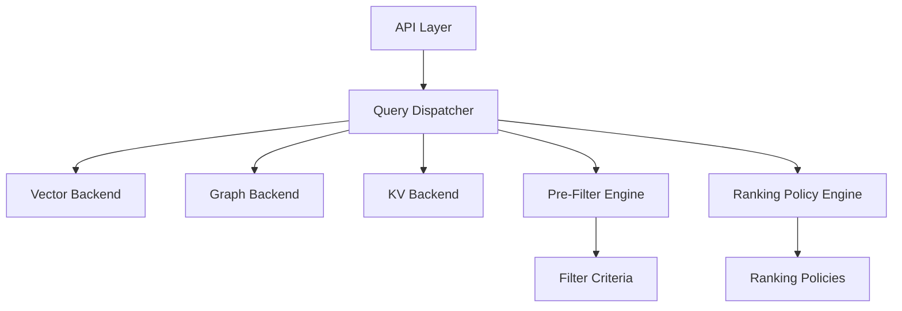

# Veris Memory Developer Guide

Comprehensive documentation for developers working with the Veris Memory system.

## Quick Start

### Development Setup

1. **Clone and Setup Environment**
   ```bash
   git clone <repository-url>
   cd veris-memory
   python -m venv venv
   source venv/bin/activate  # On Windows: venv\Scripts\activate
   pip install -r requirements.txt
   ```

2. **Run Tests**
   ```bash
   # Quick test run
   ./scripts/run-tests.sh quick
   
   # Full test suite with coverage
   ./scripts/run-tests.sh coverage
   ```

3. **Start Development Environment**
   ```bash
   # Using Docker (recommended)
   docker-compose -f docker/docker-compose.yml up
   
   # Or start components manually
   python -m src.api.main
   ```

### Project Structure

```
veris-memory/
├── src/                    # Core application code
│   ├── api/               # REST API layer
│   ├── core/              # Core business logic
│   ├── storage/           # Storage backends
│   ├── filters/           # Pre and post filtering
│   ├── ranking/           # Ranking policies
│   └── interfaces/        # Shared interfaces
├── tests/                 # Test suites
├── tools/                 # CLI tools and utilities
├── docs/                  # Documentation
├── scripts/               # Build and deployment scripts
└── docker/                # Docker configurations
```

## Architecture Overview

### Component Architecture



### Core Components

- **Query Dispatcher**: Central orchestration of search requests
- **Storage Backends**: Pluggable storage implementations (Vector, Graph, KV)
- **Filtering System**: Pre and post-filtering with configurable criteria
- **Ranking System**: Pluggable ranking policies for result ordering
- **API Layer**: FastAPI-based REST interface with full OpenAPI documentation

## Development Workflows

### Adding a New Backend

1. **Implement Backend Interface**
   ```python
   # src/storage/my_backend.py
   from interfaces.storage_backend import StorageBackend
   
   class MyBackend(StorageBackend):
       async def search_contexts(self, query: str, limit: int = 10) -> List[MemoryResult]:
           # Implementation here
           pass
   ```

2. **Register Backend**
   ```python
   # In your initialization code
   dispatcher = QueryDispatcher()
   dispatcher.register_backend("my_backend", MyBackend())
   ```

3. **Add Tests**
   ```python
   # tests/storage/test_my_backend.py
   class TestMyBackend:
       async def test_search_contexts(self):
           backend = MyBackend()
           results = await backend.search_contexts("test query")
           assert len(results) > 0
   ```

### Adding a New Ranking Policy

1. **Implement Ranking Policy**
   ```python
   # src/ranking/policies/my_policy.py
   from ranking.ranking_policy import RankingPolicy
   
   class MyRankingPolicy(RankingPolicy):
       def score_results(self, results: List[MemoryResult], query: str) -> List[MemoryResult]:
           # Custom scoring logic
           return sorted(results, key=lambda r: self.calculate_score(r, query), reverse=True)
   ```

2. **Register Policy**
   ```python
   # In ranking policy engine
   engine = RankingPolicyEngine()
   engine.register_policy("my_policy", MyRankingPolicy())
   ```

### Adding API Endpoints

1. **Create Route Handler**
   ```python
   # src/api/routes/my_routes.py
   from fastapi import APIRouter, Depends
   
   router = APIRouter(prefix="/api/v1/my-feature", tags=["my-feature"])
   
   @router.get("/endpoint")
   async def my_endpoint():
       return {"message": "Hello from my endpoint"}
   ```

2. **Include Router**
   ```python
   # src/api/main.py
   from api.routes.my_routes import router as my_router
   
   app.include_router(my_router)
   ```

## Testing Guide

### Test Organization

- **Unit Tests**: `tests/` - Test individual components in isolation
- **Integration Tests**: `tests/integration/` - Test component interactions
- **API Tests**: `tests/api/` - Test REST API endpoints
- **Performance Tests**: Use CLI tools for load testing

### Running Tests

```bash
# Quick unit tests (30 seconds)
./scripts/run-tests.sh quick

# Full test suite with coverage (2-3 minutes)
./scripts/run-tests.sh

# Specific test module
python -m pytest tests/storage/ -v

# Integration tests only
python -m pytest tests/integration/ -v

# API tests only
python -m pytest tests/api/ -v
```

### Test Patterns

**Async Test Example:**
```python
import pytest

class TestMyAsyncComponent:
    @pytest.mark.asyncio
    async def test_async_method(self):
        component = MyAsyncComponent()
        result = await component.async_method()
        assert result is not None
```

**Mock Backend Example:**
```python
from unittest.mock import AsyncMock

@pytest.fixture
def mock_backend():
    backend = AsyncMock()
    backend.search_contexts.return_value = [
        MemoryResult(id="test", text="test content")
    ]
    return backend
```

### Coverage Requirements

- Maintain minimum 25% overall coverage
- New modules should have >80% coverage
- Critical paths (API, core logic) should have >90% coverage

## Code Standards

### Python Style

- Follow PEP 8 style guide
- Use type hints for all public interfaces
- Maximum line length: 100 characters
- Use descriptive variable and function names

**Example:**
```python
from typing import List, Optional
from datetime import datetime

async def search_contexts(
    self,
    query: str,
    search_mode: SearchMode = SearchMode.HYBRID,
    limit: Optional[int] = None
) -> List[MemoryResult]:
    """
    Search for contexts matching the given query.
    
    Args:
        query: The search query string
        search_mode: The search mode to use
        limit: Maximum number of results to return
        
    Returns:
        List of matching memory results
        
    Raises:
        ValueError: If query is empty or invalid
    """
    if not query.strip():
        raise ValueError("Query cannot be empty")
    
    # Implementation here
    return results
```

### Documentation

- Use docstrings for all classes and functions
- Include type information in docstrings
- Document complex algorithms and business logic
- Keep README files up to date

### Error Handling

- Use specific exception types
- Include context in error messages
- Log errors with appropriate levels
- Handle async errors properly

**Example:**
```python
try:
    result = await backend.search_contexts(query)
except ConnectionError as e:
    logger.error(f"Backend connection failed: {e}")
    raise BackendUnavailableError(f"Cannot connect to {backend.name}") from e
except Exception as e:
    logger.error(f"Unexpected error in search: {e}")
    raise SearchError("Search operation failed") from e
```

## API Development

### FastAPI Best Practices

- Use Pydantic models for request/response validation
- Include comprehensive OpenAPI documentation
- Implement proper error handling middleware
- Use dependency injection for shared resources

**Model Example:**
```python
from pydantic import BaseModel, Field
from typing import List, Optional

class SearchRequest(BaseModel):
    query: str = Field(..., min_length=1, description="Search query")
    limit: Optional[int] = Field(10, ge=1, le=100, description="Max results")
    search_mode: SearchMode = Field(SearchMode.HYBRID, description="Search mode")
    
    class Config:
        schema_extra = {
            "example": {
                "query": "python authentication function",
                "limit": 10,
                "search_mode": "hybrid"
            }
        }
```

**Endpoint Example:**
```python
@router.post("/search", response_model=SearchResponse)
async def search_contexts(
    request: SearchRequest,
    dispatcher: QueryDispatcher = Depends(get_query_dispatcher)
) -> SearchResponse:
    """
    Search for contexts matching the query.
    
    This endpoint performs semantic and/or structural search across
    all registered backends and returns ranked results.
    """
    try:
        result = await dispatcher.dispatch_query(
            query=request.query,
            search_mode=request.search_mode,
            limit=request.limit
        )
        
        return SearchResponse(
            success=result.success,
            results=result.results,
            total_count=len(result.results),
            response_time_ms=result.response_time_ms
        )
        
    except Exception as e:
        logger.error(f"Search failed: {e}")
        raise HTTPException(status_code=500, detail="Search operation failed")
```

## Performance Guidelines

### Optimization Strategies

1. **Use Async/Await Properly**
   - Use `asyncio.gather()` for parallel operations
   - Don't block the event loop with CPU-intensive tasks
   - Use connection pooling for database operations

2. **Caching**
   - Cache frequently accessed data
   - Use appropriate cache TTLs
   - Implement cache invalidation strategies

3. **Database Optimization**
   - Use appropriate indexes
   - Optimize query patterns
   - Consider connection pooling

**Async Pattern Example:**
```python
async def search_all_backends(self, query: str) -> List[MemoryResult]:
    """Search all backends in parallel."""
    tasks = [
        backend.search_contexts(query)
        for backend in self.backends.values()
    ]
    
    results = await asyncio.gather(*tasks, return_exceptions=True)
    
    # Process results and handle exceptions
    combined_results = []
    for i, result in enumerate(results):
        if isinstance(result, Exception):
            logger.warning(f"Backend {list(self.backends.keys())[i]} failed: {result}")
        else:
            combined_results.extend(result)
    
    return combined_results
```

### Performance Monitoring

- Use the built-in metrics middleware
- Monitor response times and error rates
- Set up alerts for performance degradation
- Use CLI tools for load testing

## Debugging Guide

### Logging

Configure logging levels appropriately:

```python
import logging

# Development
logging.basicConfig(level=logging.DEBUG)

# Production
logging.basicConfig(level=logging.INFO)

# Component-specific logging
logger = logging.getLogger(__name__)
logger.setLevel(logging.DEBUG)
```

### Common Issues

1. **Backend Connection Failures**
   - Check backend health endpoints
   - Verify connection configurations
   - Review network connectivity

2. **Performance Issues**
   - Use CLI profiling tools
   - Check database query performance
   - Monitor resource usage

3. **Test Failures**
   - Run tests with `-v` flag for verbose output
   - Check test isolation (no shared state)
   - Verify mock configurations

### Debug Tools

1. **CLI Query Simulator**
   ```bash
   python tools/cli/query_simulator.py
   # Interactive testing and debugging
   ```

2. **System Validation**
   ```bash
   python tools/cli/testing_tools.py validate
   # Comprehensive system health check
   ```

3. **Load Testing**
   ```bash
   python tools/cli/testing_tools.py load-test --concurrent-users 10
   # Performance testing and profiling
   ```

## Deployment

### Local Development

```bash
# Using Docker Compose
docker-compose -f docker/docker-compose.yml up

# Manual startup
python -m src.api.main
```

### Production Deployment

See [Production Deployment Guide](../deployment/production.md) for detailed production deployment instructions.

### Environment Configuration

```bash
# Development
export VERIS_MEMORY_ENV=development
export VERIS_MEMORY_LOG_LEVEL=DEBUG

# Production
export VERIS_MEMORY_ENV=production
export VERIS_MEMORY_LOG_LEVEL=INFO
```

## Contributing

### Pull Request Process

1. Create feature branch from `main`
2. Implement changes with tests
3. Run full test suite
4. Update documentation
5. Submit pull request with description

### Code Review Checklist

- [ ] Tests pass and coverage maintained
- [ ] Code follows style guidelines
- [ ] Documentation updated
- [ ] API changes documented
- [ ] Performance impact considered
- [ ] Security implications reviewed

### Release Process

1. Update version numbers
2. Update CHANGELOG.md
3. Tag release in Git
4. Deploy to staging
5. Run integration tests
6. Deploy to production

## Troubleshooting

### Common Development Issues

1. **Import Errors**
   - Ensure PYTHONPATH includes src directory
   - Check virtual environment activation
   - Verify dependency installation

2. **Test Environment Issues**
   - Reset test databases between runs
   - Check test isolation
   - Verify mock configurations

3. **Docker Issues**
   - Check Docker daemon status
   - Verify port availability
   - Review Docker logs

### Getting Help

- Check existing documentation
- Review test examples
- Use CLI tools for system validation
- Create GitHub issues for bugs
- Contact development team for questions

## Resources

- [API Documentation](../api/README.md) - REST API reference
- [Storage Backends](../storage/README.md) - Backend implementation guide
- [Deployment Guide](../deployment/README.md) - Production deployment
- [CLI Tools](../../tools/cli/README.md) - Command-line utilities
- [Testing Guide](../testing/README.md) - Comprehensive testing documentation

---

*This documentation is maintained by the Veris Memory development team. Please keep it updated as the system evolves.*