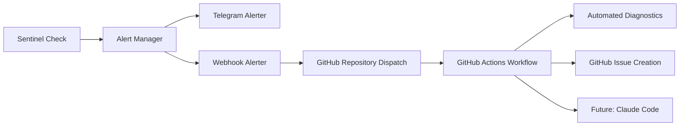

# 🚨 Sentinel GitHub Webhook Integration

## Overview

This implementation adds automated GitHub Actions integration to Veris Memory Sentinel monitoring, enabling:

- **Automated Alert Response**: Sentinel alerts trigger GitHub Actions workflows
- **Intelligent Diagnostics**: Automated health checks and issue creation
- **Visual Monitoring**: GitHub Issues provide centralized alert tracking  
- **Future Claude Code Integration**: Foundation for automated debugging

## 🏗️ Architecture



## 📁 Files Added/Modified

### New Files
- `src/monitoring/sentinel/webhook_alerter.py` - GitHub webhook alerter implementation
- `.github/workflows/sentinel-alert-response.yml` - GitHub Actions workflow
- `scripts/test-webhook-integration.py` - End-to-end testing script
- `WEBHOOK_GITHUB_ACTIONS_CLAUDE_INTEGRATION_PLAN.md` - Comprehensive implementation plan

### Modified Files  
- `src/monitoring/sentinel/alert_manager.py` - Integrated webhook alerter

## 🚀 Quick Start

### 1. Environment Setup

```bash
# Required environment variables
export GITHUB_TOKEN="your-github-token"
export SENTINEL_GITHUB_REPO="credentum/veris-memory"

# Optional (for enhanced security)
export SENTINEL_WEBHOOK_SECRET="your-webhook-secret"
```

### 2. Test the Integration

```bash
# Test connectivity
python scripts/test-webhook-integration.py connectivity

# Test critical alerts
python scripts/test-webhook-integration.py critical

# Run all tests
python scripts/test-webhook-integration.py all
```

### 3. Monitor Results

After running tests:
1. **GitHub Actions**: Check [Actions tab](https://github.com/credentum/veris-memory/actions) for workflow runs
2. **GitHub Issues**: Check [Issues tab](https://github.com/credentum/veris-memory/issues) for created alerts
3. **Logs**: Review test output and workflow logs

## 📊 Alert Flow Details

### Alert Severity Mapping
- **Sentinel Status** → **GitHub Severity** → **Action Taken**
- `fail` → `critical` → GitHub Issue + Full Diagnostics
- `warn` → `warning` → GitHub Issue + Basic Diagnostics
- `pass` → `info` → No action (success)

### Automatic Diagnostics
The GitHub Actions workflow automatically:
- Tests server connectivity
- Checks all service endpoints
- Collects system health information
- Performs category-specific diagnostics
- Creates detailed GitHub Issues

### Rate Limiting
- Maximum 10 alerts per minute per alerter
- Prevents webhook spam
- Graceful degradation on rate limit

## 🔧 Configuration

### GitHub Token Permissions
Required permissions for `GITHUB_TOKEN`:
- `contents: write` - For creating PRs (future)
- `issues: write` - For creating issues
- `actions: write` - For triggering workflows

### Webhook Security
```bash
# Optional: Set webhook signature secret
export SENTINEL_WEBHOOK_SECRET="your-secret-key"
```

### Alert Manager Integration
The webhook alerter is automatically initialized alongside Telegram:

```python
# In AlertManager.__init__()
self.webhook_alerter = GitHubWebhookAlerter()
# Alerts sent to both Telegram and GitHub Actions
```

## 📋 Testing Guide

### Test Types Available

```bash
# Connectivity test only
python scripts/test-webhook-integration.py connectivity

# Critical alert workflow
python scripts/test-webhook-integration.py critical

# Warning alert workflow  
python scripts/test-webhook-integration.py warning

# Complete test suite
python scripts/test-webhook-integration.py all
```

### Expected Results

**Successful Test Output:**
```
🧪 WEBHOOK INTEGRATION TEST REPORT
====================================
📅 Test Date: 2025-08-20T23:52:00
🏷️ Overall Status: PASSED

📊 Webhook Configuration:
  • Enabled: True
  • Repository: credentum/veris-memory
  • Rate Limit Remaining: 8

🧪 Test Results:
  ✅ connectivity: GitHub API connectivity test
  ✅ critical_alert: Critical alert webhook test  
  ✅ warning_alert: Warning alert webhook test
  ✅ alert_manager: Alert manager integration test
  ✅ rate_limiting: Rate limiting functionality test
```

## 🔍 Troubleshooting

### Common Issues

**1. GitHub API 401 Error**
```bash
# Check token
echo $GITHUB_TOKEN

# Re-authenticate
gh auth login
export GITHUB_TOKEN=$(gh auth token)
```

**2. No Workflow Triggered**
- Verify repository has the workflow file
- Check GitHub token permissions
- Review webhook alerter logs

**3. Rate Limiting**
```bash
# Check current status
python -c "
from src.monitoring.sentinel.webhook_alerter import GitHubWebhookAlerter
import asyncio
alerter = GitHubWebhookAlerter()
print(alerter.get_status())
"
```

### Debug Mode
```bash
# Enable debug logging
export LOG_LEVEL=DEBUG
python scripts/test-webhook-integration.py all
```

## 🎯 Current Status (Phase 1 Complete)

### ✅ Implemented
- GitHub webhook alerter with rate limiting
- GitHub Actions workflow with automated diagnostics
- Alert manager integration
- End-to-end testing framework
- Comprehensive documentation

### 🔄 Next Steps (Phase 2-4)

**Phase 2: Enhanced Diagnostics**
- Advanced health checks
- Log collection and analysis
- Service dependency mapping
- Performance metrics gathering

**Phase 3: Claude Code Integration**  
- Automated Claude Code session creation
- Alert context passing
- Automated debugging and fix generation
- PR creation with proposed fixes

**Phase 4: Advanced Automation**
- Self-healing systems
- Predictive monitoring
- Deployment integration
- Machine learning for pattern recognition

## 📖 API Reference

### GitHubWebhookAlerter

```python
from monitoring.sentinel.webhook_alerter import GitHubWebhookAlerter

# Initialize
alerter = GitHubWebhookAlerter()

# Send alert
await alerter.send_alert(check_result)

# Test connectivity
connected = await alerter.test_connectivity()

# Get status
status = alerter.get_status()
```

### GitHub Actions Payload

```json
{
  "event_type": "sentinel-alert",
  "client_payload": {
    "alert_id": "S1-health-probes-1724196720",
    "check_id": "S1-health-probes", 
    "status": "fail",
    "severity": "critical",
    "message": "API health check failed",
    "timestamp": "2025-08-20T23:52:00Z",
    "latency_ms": 250.0,
    "details": {...},
    "source": "veris-sentinel",
    "environment": "production"
  }
}
```

## 🔐 Security Considerations

- GitHub tokens stored securely in environment variables
- Optional HMAC signature verification for webhooks
- Rate limiting prevents abuse
- Minimal required permissions

## 📞 Support

For issues or questions:
1. Check troubleshooting section above
2. Review GitHub Actions workflow logs
3. Run test suite for diagnostics
4. Create GitHub issue with test results

---

**🤖 Generated by Claude Code Integration**  
**Phase 1 Implementation Complete - Ready for Phase 2**